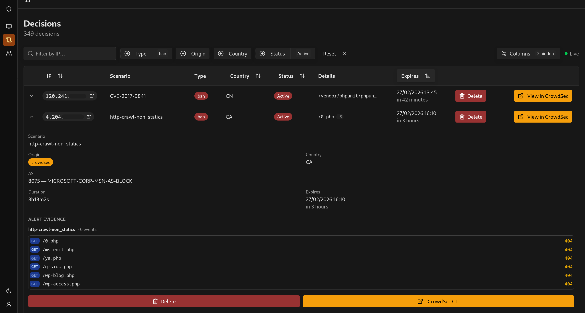
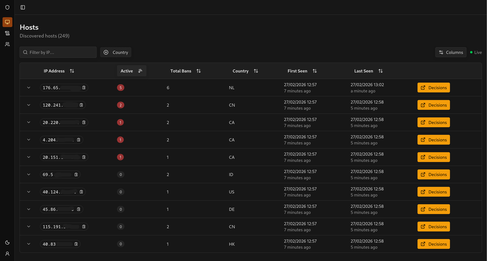
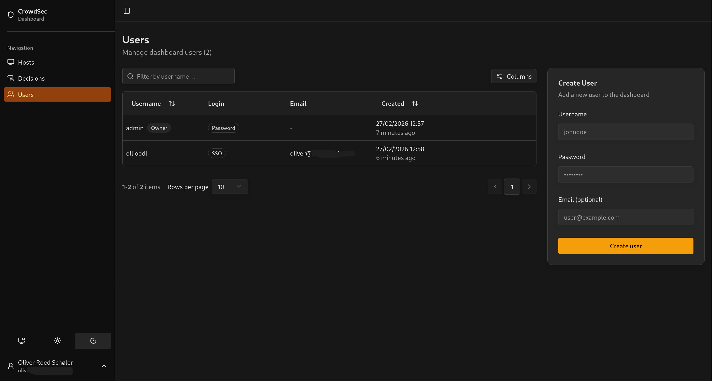
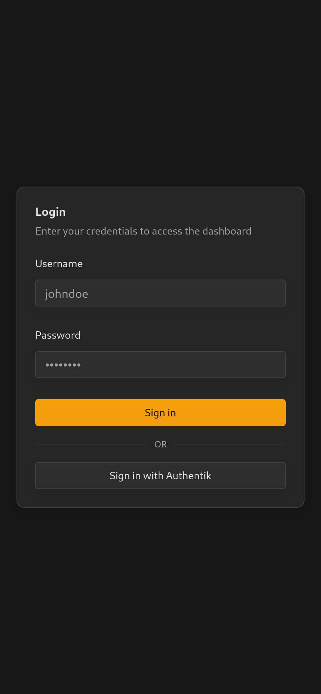
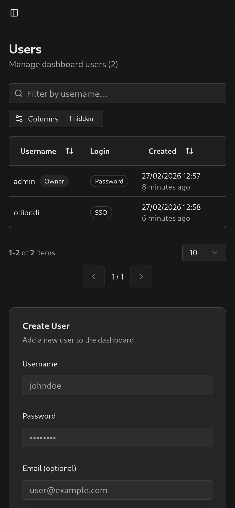
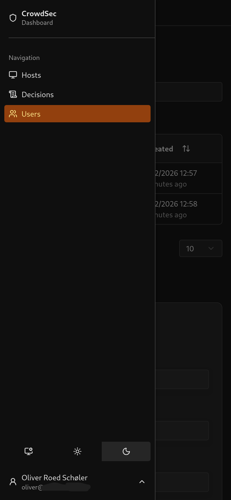
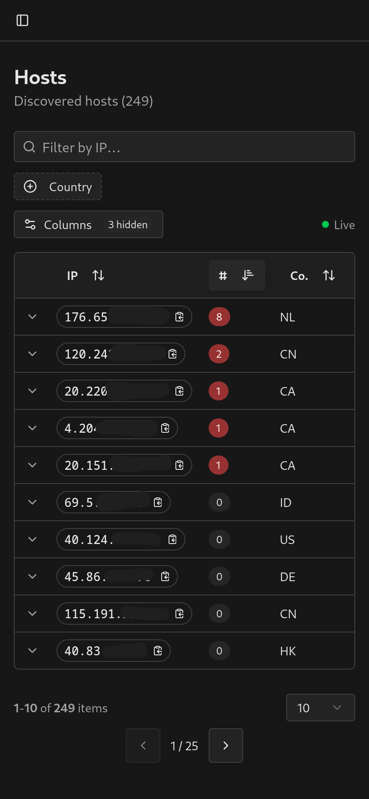
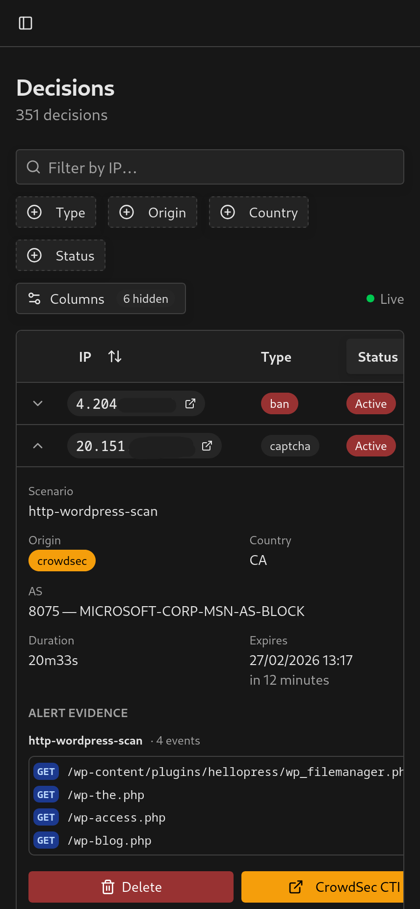
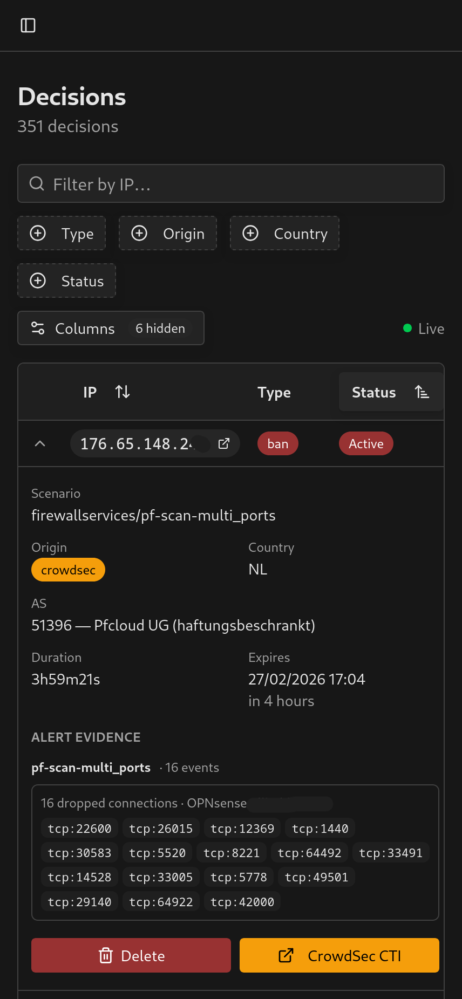

# CrowdSec Dashboard

> **Beta software**: expect rough edges and possibly breaking changes. Feature requests and bug reports are welcome.

A self-hosted local web dashboard for viewing and managing decisions made by your [CrowdSec](https://crowdsec.net) instance. Built for homelab use - no enterprise account or cloud connectivity required.

<br/>

---

## Why?

CrowdSec is great at blocking malicious traffic. The problem is managing false positives from the command line, especially from a phone:

```sh
# The old workflow
ssh myserver
docker exec -it crowdsec bash
cscli decisions list        # find the IP
cscli decisions delete --ip 1.2.3.4
```

This dashboard replaces all of that with a filterable table and a delete button.

---

## Screenshots (Desktop)

<table>
  <tr>
    <td align="center"><br/><sub>Hosts - sortable, filterable IP list with active ban counts</sub></td>
    <td align="center"><br/><sub>Users - Show users and login sources</sub></td>
  </tr>
</table>

## Screenshots (Mobile)

<table>
  <tr>
    <td align="center"><br/><sub>Login with optional OIDC SSO (Button text can be customized)</sub></td>
    <td align="center"><br/><sub>Users - Show users and login sources</sub></td>
  </tr>
  <tr>
    <td align="center"><br/><sub>Sidebar - slide-out navigation with theme toggle</sub></td>
    <td align="center"><br/><sub>Hosts - sortable, filterable IP list with active ban counts</sub></td>
  </tr>
    <tr>
    <td align="center"><br/><sub>Decisions - expanded row showing HTTP alert details</sub></td>
    <td align="center"><br/><sub>Decisions - expanded row showing Port Scan alert details</sub></td>
  </tr>
</table>


## Features

- **Host overview** - every IP CrowdSec has ever seen, with active ban count and country enrichment
- **Decision management** - filter by IP, type, origin, or status; delete decisions with one click
- **Alert Extraction** - view alerts associated with each decision. Shows which ports are scanned, and which paths are requested.
  - Currently `"pf_drop" | "pf_pass" | "http_access-log"` are supported, but more can be added on request.
  - These types are generated by Opnsense and Traefik parsers. If your events are missing alert data, submit an issue with a sample event and I'll add support. 
- **Real-time updates** - live changes streamed via Server-Sent Events (no polling on the client)
- **Historical tracking** - decisions are mirrored to a local SQLite database; expired bans stay visible
- **User management** - local username/password accounts; the first registered user becomes admin
- **SSO login** - optional OIDC/OAuth integration; works with Authentik, Keycloak, Okta, and any other standards-compliant provider
- **Mobile-friendly** - responsive tables that collapse gracefully on small screens
- **Dark mode** - follows system preference
- **PWA support** - installable on desktop and mobile;

---

## Prerequisites

- A running [CrowdSec](https://crowdsec.net) instance with an accessible Local API (LAPI)
- **Docker + Docker Compose** (recommended)
  _or_ Node.js 22+ for a manual install

---

## Quick Start (Docker)

### 1. Download the compose file

```sh
curl -o docker-compose.yml https://raw.githubusercontent.com/ollioddi/crowdsec-dashboard/main/docker-compose.yml
```

Or clone the full repo if you want to build from source:

```sh
git clone https://github.com/ollioddi/crowdsec-dashboard.git
cd crowdsec-dashboard
```

### 2. Configure

```sh
curl -o .env https://raw.githubusercontent.com/ollioddi/crowdsec-dashboard/main/.env.example
```

Edit `.env` with your values - see [Configuration](#configuration) below.

### 3. Run

```sh
docker compose up -d
```

Open [http://localhost:3000](http://localhost:3000). On first launch you will be prompted to create your admin account.

### Updating

```sh
docker compose pull
docker compose up -d
```

The SQLite database is stored in a Docker volume (`db`) and survives updates.

---

## Configuration

| Variable | Required | Default | Description |
|---|---|---|---|
| `DATABASE_URL` | | `file:/data/app.db` | SQLite path. Defaults to the persistent volume - no need to change. |
| `BETTER_AUTH_SECRET` | Yes | | Secret used to sign sessions. Generate with `npx @better-auth/cli secret`. |
| `BETTER_AUTH_URL` | | _(inferred from request)_ | Set this if cookies or auth redirects break - this happens when Node.js sees an internal URL (e.g. `http://localhost:3000`) instead of the external one (e.g. `https://dashboard.example.com`). |
| `LAPI_URL` | Yes | | CrowdSec LAPI base URL including port, e.g. `http://192.168.1.100:8080`. |
| `LAPI_MACHINE_ID` | Yes | | Machine ID for watcher authentication. |
| `LAPI_MACHINE_PASSWORD` | Yes | | Machine password for watcher authentication. |
| `LAPI_BOUNCER_API_TOKEN` | Yes | | API token for bouncer (read) access. |
| `LAPI_POLL_INTERVAL` | | `60` | Seconds between LAPI decision syncs. |
| `OIDC_CLIENT_ID` | | | Client ID from your OIDC provider. Required to enable SSO. |
| `OIDC_CLIENT_SECRET` | | | Client secret from your OIDC provider. Required to enable SSO. |
| `OIDC_ISSUER_URL` | | | Issuer URL of your OIDC provider, e.g. `https://authentik.example.com/application/o/my-app/`. Required to enable SSO. |
| `OIDC_BUTTON_LABEL` | | `Sign in with SSO` | Label shown on the SSO login button. |
| `OIDC_AUTO_REDIRECT` | | `false` | Set to `true` to skip the login form and redirect straight to your SSO provider. |

---

## CrowdSec LAPI Setup

The dashboard authenticates with LAPI in two ways:

### Watcher credentials (Machine ID + Password)

Used to stream decisions. These are the credentials your CrowdSec agent already uses:

```sh
cat /etc/crowdsec/local_api_credentials.yaml
```

Copy `login` to `LAPI_MACHINE_ID` and `password` to `LAPI_MACHINE_PASSWORD`.

### Bouncer API token

Used for querying decisions. Create a dedicated bouncer on your CrowdSec host:

```sh
cscli bouncers add crowdsec-dashboard
```

Copy the generated token into `LAPI_BOUNCER_API_TOKEN`. It is only shown once.

> **Note:** This dashboard communicates exclusively with your **local** LAPI. It never contacts the CrowdSec Central API (CAPI) directly.

---

## SSO / OIDC Setup

SSO is optional. When the three `OIDC_*` variables are set, a "Sign in with SSO" button appears on the login page alongside the existing username/password form. Username/password login is always kept available so you can still access the dashboard if your identity provider is unreachable.

### 1. Register the application with your provider

Create an OAuth2/OIDC application in your identity provider (Authentik, Keycloak, Okta, etc.) with:

- **Client type:** Confidential
- **Redirect URI:** `https://your-dashboard-url/api/auth/oauth2/callback/oidc`
- **Scopes:** `openid`, `email`, `profile`

Note the **client ID**, **client secret**, and **issuer URL** provided by your identity provider.

### 2. Set the environment variables

```env
OIDC_CLIENT_ID=your-client-id
OIDC_CLIENT_SECRET=your-client-secret
OIDC_ISSUER_URL=https://authentik.example.com/application/o/my-app/
```

### 3. Optional: customise the button or skip the form

```env
# Change the button label (default: "Sign in with SSO")
OIDC_BUTTON_LABEL=Sign in with Authentik

# Redirect straight to your SSO provider without showing the login form
OIDC_AUTO_REDIRECT=true
```

> `OIDC_AUTO_REDIRECT` is ignored on first launch so the admin account can still be created with a username and password.

---

## Deployment

Docker Compose is the recommended approach for homelab use. The container applies any pending schema changes on every startup and then launches the server.

### Other options

TanStack Start can be deployed to many platforms. As long as the runtime can reach your LAPI at `LAPI_URL`, it will work:

| Platform | Notes |
|---|---|
| **Node.js** | Clone the repo, then `pnpm run build && node .output/server/index.mjs` |
| **Railway** | Connect your GitHub repo - zero config required |
| **Vercel / Netlify** | Serverless; requires LAPI to be reachable from the edge |
| **Bun** | Replace the start command with `bun .output/server/index.mjs` |

See the [TanStack Start hosting docs](https://tanstack.com/start/latest/docs/framework/react/hosting) for a full list.

> If your LAPI is only reachable on a local network, the dashboard must run on the same network - for example, via Docker on the same host or over a VPN.

---

## Development

```sh
pnpm install
cp .env.example .env   # fill in your values
pnpm run db:push       # creates the SQLite schema and generates the Prisma client
pnpm run dev           # start dev server on http://localhost:3000
```

---

## Tech Stack

| | |
|---|---|
| **Framework** | [TanStack Start](https://tanstack.com/start) - full-stack React with SSR and file-based routing |
| **Database** | SQLite via [Prisma ORM](https://prisma.io) with the `better-sqlite3` driver |
| **Auth** | [Better Auth](https://better-auth.com) - username/password with session management; optional OIDC/OAuth SSO |
| **UI** | [shadcn/ui](https://ui.shadcn.com) components on top of [Tailwind CSS v4](https://tailwindcss.com) |
| **Tables** | [TanStack Table](https://tanstack.com/table) with faceted filters and pagination |
| **Real-time** | Server-Sent Events pushed from the server on every sync |

---

## Future Improvements

- **Create decisions** - the ability to submit simple decisions (e.g. "ban this IP for 1 hour") directly from the UI

- **You tell me!** Create an issue or drop a suggestion if there's something you'd like to see.

## License
This project is licensed under the MIT License. See the [LICENSE](LICENSE) file for details.

## Disclaimer

This project is not affiliated with or endorsed by CrowdSec.

The [CrowdSec Console](https://www.crowdsec.net/console/) is the official solution for managing decisions and it is genuinely excellent - it offers threat intelligence, detailed attacker insights, geolocation analysis, ASN data, behavioral trends, and a polished interface that goes far beyond what this project does. If you are running anything beyond a personal homelab, you should use it.

This dashboard exists for one narrow reason: the official console is a paid product (At the time of writing a 232$ monthly subscription to delete alerts), and for simple homelab use the only thing I needed was to delete a ban from my phone without SSH-ing into a server. The scope of this project intentionally stays small. Feature requests are welcome, but this will not grow into a general CrowdSec management tool - anything that significantly expands that scope is outside what I am willing to maintain.

Supporting CrowdSec through their paid products also funds the development of the open source agent, which benefits everyone. If this dashboard saves you time, and gives you value, consider whether the official console is worth it for your use case.
