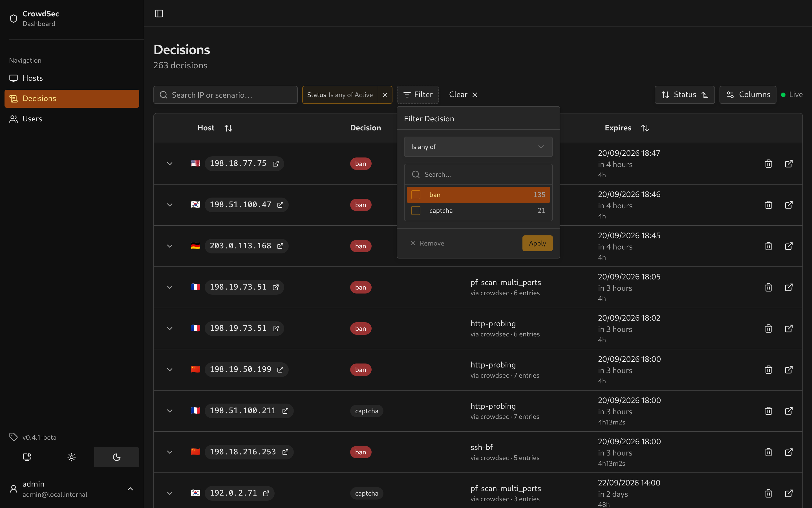
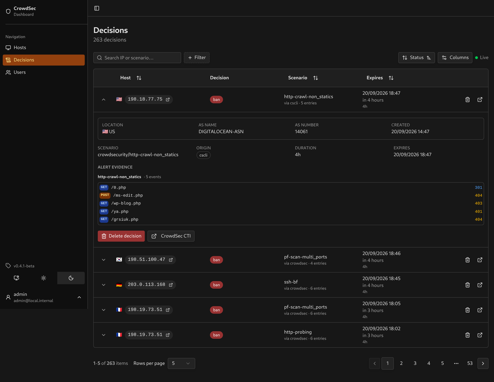
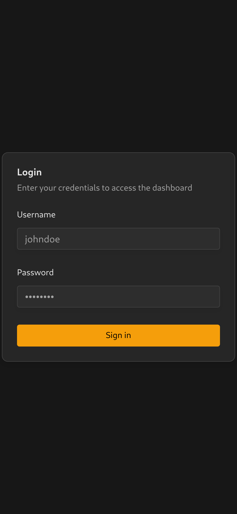
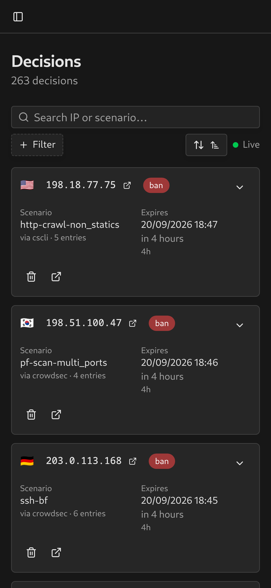
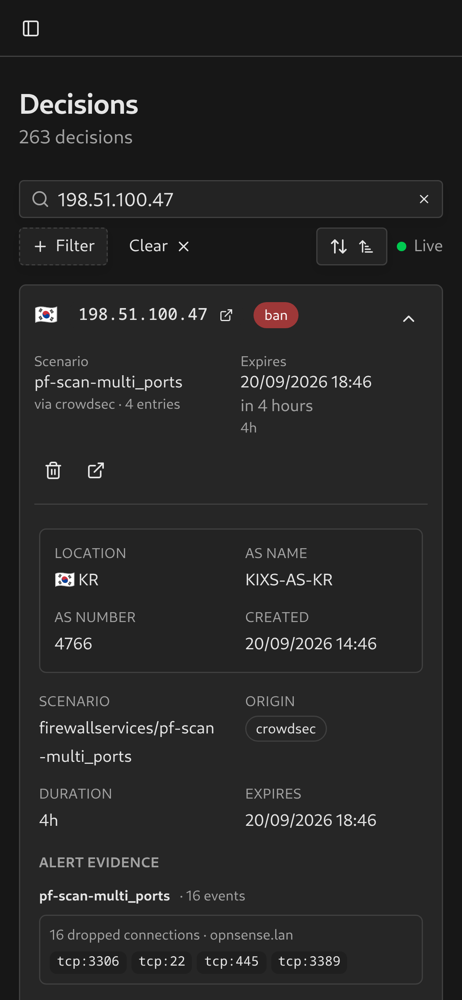
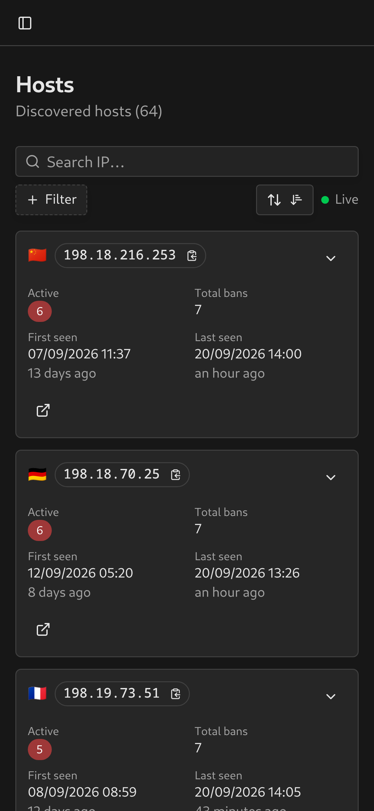
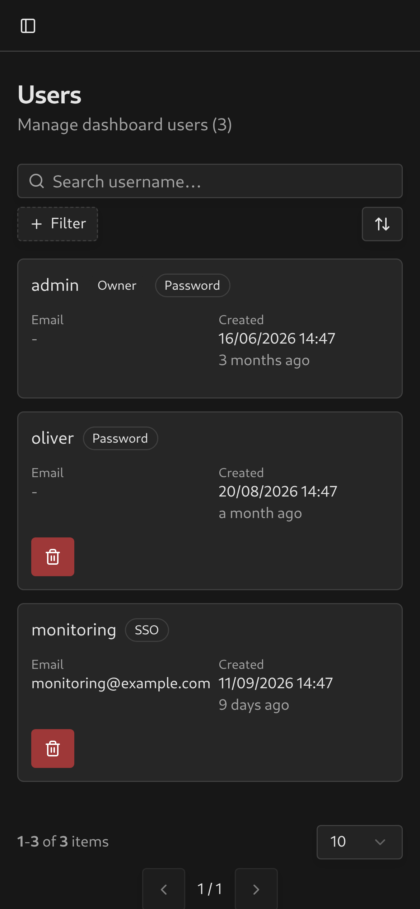

# CrowdSec Local Dashboard
> [!IMPORTANT]
> This project is in beta. Expect breaking changes and incomplete features.

A self-hosted local web dashboard for viewing and managing decisions made by your [CrowdSec](https://crowdsec.net) instance. Built for homelab use - no enterprise account or cloud connectivity required.

<!-- screenshots:hero -->
<br/>
<!-- /screenshots:hero -->

---

## Why?

CrowdSec is great at blocking malicious traffic. The problem is managing false positives from the command line, especially from a phone:

```sh
# The old workflow
ssh myserver
docker exec -it crowdsec bash
cscli decisions list        # find the IP
cscli decisions delete --ip 1.2.3.4
```

This dashboard replaces all of that with a filterable table and a delete button.

---

## Screenshots (Desktop)

<!-- screenshots:desktop -->
<table>
  <tr>
    <td align="center"><br/><sub>Login with optional OIDC SSO (the button label is configurable)</sub></td>
    <td align="center"><br/><sub>Decisions - filter chips with per-column operators and facet counts</sub></td>
  </tr>
  <tr>
    <td align="center"><br/><sub>Decisions - expanded row showing the HTTP requests behind a ban</sub></td>
    <td align="center"><br/><sub>Hosts - sortable, filterable IP list with active ban counts</sub></td>
  </tr>
  <tr>
    <td align="center"><br/><sub>Users - local accounts and SSO logins side by side</sub></td>
  </tr>
</table>
<!-- /screenshots:desktop -->

## Screenshots (Mobile)

<!-- screenshots:mobile -->
<table>
  <tr>
    <td align="center"><br/><sub>Login with optional OIDC SSO (the button label is configurable)</sub></td>
    <td align="center"><br/><sub>Decisions - cards instead of a sideways scroll</sub></td>
    <td align="center"><br/><sub>Decisions - expanded card showing HTTP alert details</sub></td>
  </tr>
  <tr>
    <td align="center"><br/><sub>Decisions - expanded card showing a port scan</sub></td>
    <td align="center"><br/><sub>Hosts - sortable, filterable IP list with active ban counts</sub></td>
    <td align="center"><br/><sub>Users - local accounts and SSO logins side by side</sub></td>
  </tr>
  <tr>
    <td align="center"><br/><sub>Sidebar - slide-out navigation with theme toggle</sub></td>
  </tr>
</table>
<!-- /screenshots:mobile -->

## Features

- **Host overview** - every IP CrowdSec has ever seen, with active ban count and country enrichment
- **Decision management** - filter by IP, type, origin, or status; delete decisions with one click
- **Alert Extraction** - view alerts associated with each decision. Shows which ports are scanned, and which paths are requested.
- **Real-time updates** - live changes streamed via Server-Sent Events (no polling on the client)
- **Historical tracking** - decisions are mirrored to a local SQLite database; expired bans stay visible
- **User management** - local username/password accounts; the first registered user becomes admin
- **SSO login** - optional OIDC/OAuth integration; works with Authentik, Keycloak, Okta, and any other standards-compliant provider
- **Mobile-friendly** - responsive tables that collapse gracefully on small screens
- **Dark mode** - follows system preference
- **PWA installable** - installs as a Progressive Web App on supported devices.

## What it is built against

I run CrowdSec behind **Traefik** for HTTP and **OPNsense** for the firewall, so those are the two stacks this is actually tested on.

Decisions and hosts work with any CrowdSec setup. What is stack-specific is the alert evidence in the expanded row, which is parsed per log type. A stack with no parser still shows the ban, just without the breakdown.

Missing yours? [Open an issue](https://github.com/ollioddi/crowdsec-local-dashboard/issues/new/choose) with a sample alert and I will add it. The parsers are small and self-contained, I just cannot test what I do not run. See [Integrations](docs/integrations.md).

---

## Prerequisites

- A running [CrowdSec](https://crowdsec.net) instance with an accessible Local API (LAPI)
- **Docker + Docker Compose** (recommended) _or_ Node.js 22+ for a manual install

---

## Quick Start (Docker)

### 1. Download the compose file

```sh
curl -o docker-compose.yml https://raw.githubusercontent.com/ollioddi/crowdsec-local-dashboard/main/docker-compose.yml
```

Or clone the full repo if you want to build from source:

```sh
git clone https://github.com/ollioddi/crowdsec-local-dashboard.git
cd crowdsec-local-dashboard
```

### 2. Configure

```sh
curl -o .env https://raw.githubusercontent.com/ollioddi/crowdsec-local-dashboard/main/.env.example
```

Edit `.env` with your values. This step is optional: without a `.env` the dashboard starts with a generated session secret and shows the login page, but does not sync anything until the `LAPI_*` values are set.

See [Configuration](docs/configuration.md) for every variable, and [LAPI setup](docs/lapi-setup.md) for where the CrowdSec credentials come from.

### 3. Run

```sh
docker compose up -d
```

Open [http://localhost:3000](http://localhost:3000). On first launch you will be prompted to create your admin account.

---

## Documentation

| | |
|---|---|
| [Configuration](docs/configuration.md) | Every environment variable |
| [LAPI setup](docs/lapi-setup.md) | Watcher credentials and the bouncer token |
| [SSO / OIDC](docs/sso.md) | Optional single sign-on |
| [Deployment](docs/deployment.md) | The container, updating, other platforms |
| [Getting the most out of it](docs/using-the-dashboard.md) | URL state, what Live means, simulated decisions |
| [Troubleshooting](docs/troubleshooting.md) | Login loops, empty expanded rows, sync banners |
| [Integrations](docs/integrations.md) | Traefik, OPNsense, and adding your stack |

---

## Contributing

Setup, the docs site, the screenshot script and the release process live in [docs/CONTRIBUTING.md](docs/CONTRIBUTING.md).

---

## Tech Stack

| | |
|---|---|
| **Framework** | [TanStack Start](https://tanstack.com/start) - full-stack React with SSR and file-based routing |
| **Database** | SQLite via [Prisma ORM](https://prisma.io) with the `better-sqlite3` driver |
| **Auth** | [Better Auth](https://better-auth.com) - username/password with session management; optional OIDC/OAuth SSO |
| **UI** | [shadcn/ui](https://ui.shadcn.com) components on top of [Tailwind CSS v4](https://tailwindcss.com) |
| **Tables** | [TanStack Table](https://tanstack.com/table) with faceted filters and pagination |
| **Real-time** | Server-Sent Events pushed from the server on every sync |

---

## Future Improvements

- **Create decisions** - the ability to submit simple decisions (e.g. "ban this IP for 1 hour") directly from the UI

- **You tell me!** Create an issue or drop a suggestion if there's something you'd like to see.

## License
This project is licensed under the MIT License. See the [LICENSE](LICENSE) file for details.

## Disclaimer

This project is not affiliated with or endorsed by CrowdSec.

The [CrowdSec Console](https://www.crowdsec.net/console/) is the official solution for managing decisions and it is genuinely excellent - it offers threat intelligence, detailed attacker insights, geolocation analysis, ASN data, behavioral trends, and a polished interface that goes far beyond what this project does. If you are running anything beyond a personal homelab, you should use it.

This dashboard exists for one narrow reason: the official console is a paid product (At the time of writing a 232$ monthly subscription to delete alerts), and for simple homelab use the only thing I needed was to delete a ban from my phone without SSH-ing into a server. The scope of this project intentionally stays small. Feature requests are welcome, but this will not grow into a general CrowdSec management tool - anything that significantly expands that scope is outside what I am willing to maintain.

Supporting CrowdSec through their paid products also funds the development of the open source agent, which benefits everyone. If this dashboard saves you time, and gives you value, consider whether the official console is worth it for your use case.
