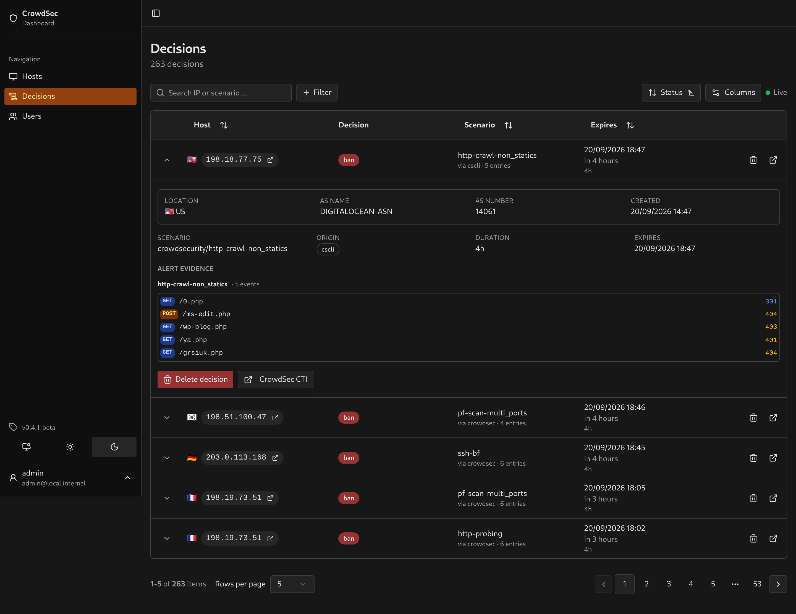

# Integrations

The dashboard syncs decisions independently of their log source. Integrations determine how it displays the alert evidence behind each decision.

| Log type | Source | Evidence shown |
|---|---|---|
| `http_access-log` | [Traefik](integrations/traefik.md) | One line per request: verb, host and path, status, time, router, user agent |
| `appsec-block`, in-band rule events | [CrowdSec AppSec (WAF)](integrations/appsec.md) | The rule that fired, whether the request was blocked, what matched, the ids that tie it to the log |
| `pf_drop`, `pf_pass` | [OPNsense](integrations/opnsense.md) | The ports touched, and the connections grouped by interface, protocol and rule |
| `ssh_failed-auth` and other SSH event types | [sshd](integrations/ssh.md) | The usernames tried, one line per attempt |
| `postfix`, postscreen events | [Postfix](integrations/postfix.md) (and mailcow) | What the client sent, then the postscreen test or smtpd verdict and reason |
| `dovecot_logs` | [Dovecot](integrations/dovecot.md) (and mailcow) | The mailboxes tried, protocols and reason, then the result of each attempt |

Traefik, AppSec, OPNsense, Postfix and Dovecot have tests built from captured alerts. SSH tests use upstream field definitions.

## What every source gets

Each alert shows its scenario, source, event count, timestamps and available bucket settings. CVE, technology and JA4H values appear when present. Location, network, agent and log source appear beside the evidence.

**Other fields** shows parsed values without a dedicated display. **Not parsed** shows nonblank metadata the parsers did not read.



## A source with no parser

The decision still appears. Its evidence is labelled **Unknown**, with unread metadata listed for each event. Shared metadata such as location and target can still be parsed.

## Adding your stack

The integration parsers live in [`src/common/parsing/integrations/`](../src/common/parsing/integrations/).

To request support, [open an issue](https://github.com/ollioddi/crowdsec-local-dashboard/issues/new) with a sample alert. I need sample data for sources I do not run. Get it with:

```sh
cscli alerts list
cscli alerts inspect <id> -o json
```

Paste the JSON including the `events[].meta` and top-level `meta` blocks, since those are what the parser reads. Replace private hostnames, addresses, usernames and request contents before posting.

To implement it, follow [Contributing a parser](contributing-a-parser.md). A new scenario using a supported log format usually needs no parser change.
