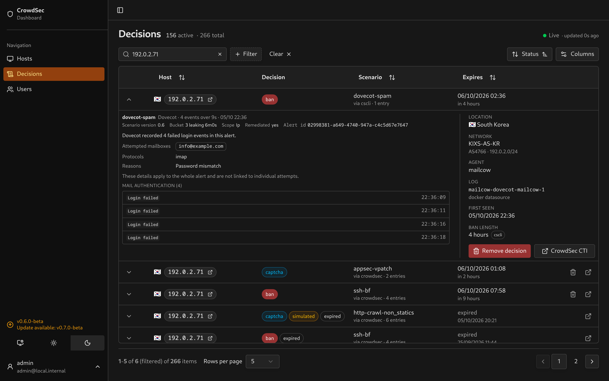
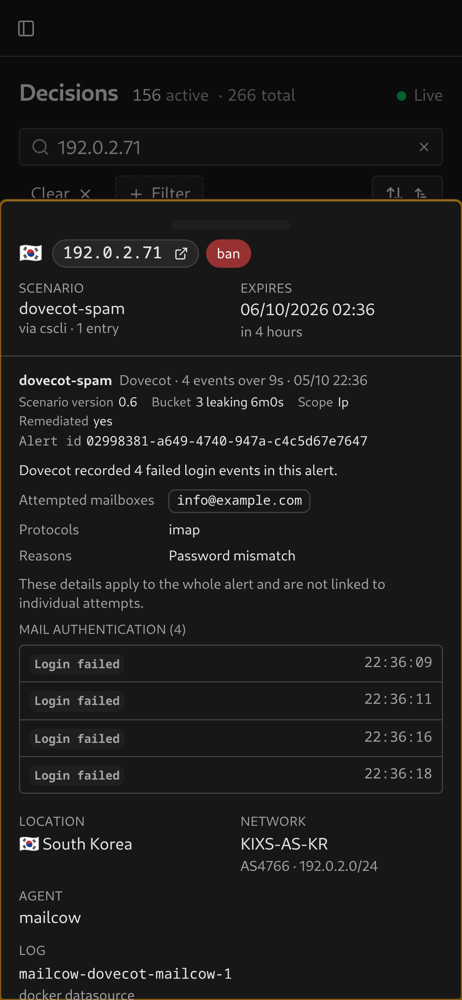

# Dovecot

Recognises `log_type: dovecot_logs`, including mailcow's Docker logs. Tested with captured `crowdsecurity/dovecot-spam` alerts.

## Evidence

The UI shows the number of retained failed login events. Attempted mailboxes appear as chips, followed by the protocols and the reasons Dovecot gave, one per line. One line per retained event shows the authentication result and time. `auth_failed` appears as **Login failed**. Unrecognised result values remain visible as supplied by CrowdSec.

<table>
  <tr>
    <td></td>
    <td></td>
  </tr>
</table>

Mailboxes, protocols and reasons summarise the whole alert and cannot be paired with individual attempts, so each event line carries only its result and time. Missing details show **Not recorded**; this does not mean no mailboxes were attempted. Reasons leave out the password hash fragment and attempt timing Dovecot adds to every attempt, so repeated attempts read as one reason. The container appears in the facts column.

## Alert-context configuration

CrowdSec's Dovecot parser reads the mailbox, protocol and failure reason from each log line, but does not include them in the alert. Without alert context the dashboard shows **Not recorded** for these details.

Add a context file on the CrowdSec agent that reads the Dovecot logs, for example `/etc/crowdsec/contexts/dovecot.yaml`:

```yaml
context:
  target_user:
    - evt.Parsed.dovecot_user # the mailbox, also the SSH username key
  protocol:
    - evt.Parsed.protocol
  login_message:
    - evt.Parsed.dovecot_login_message
```

Restart CrowdSec to load it. Only alerts raised after the change carry these values. See [CrowdSec's alert context](https://docs.crowdsec.net/docs/log_processor/alert_context/intro) for the file format.

## Why four events?

The captured scenario version 0.6 has capacity 3 and leaks one event every six minutes. Four failures within nine seconds overflow that bucket. The alert records the triggering burst, not every login attempt over the lifetime of the ban. Despite its `dovecot-spam` name, the scenario detects authentication brute force.

See the [CrowdSec scenario](https://github.com/crowdsecurity/hub/blob/master/scenarios/crowdsecurity/dovecot-spam.yaml) and [bucket settings](https://docs.crowdsec.net/docs/log_processor/scenarios/format/). Your installed scenario version or local configuration may differ.

## Setup

Configure CrowdSec to collect Dovecot logs and give the dashboard [watcher credentials](../lapi-setup.md). Existing stored alerts are parsed again when expanded; no database migration is needed. Mailcow's SMTP events are covered separately by [Postfix](postfix.md).

If event times are off by whole hours from the alert's start, Dovecot is logging local time without a zone and CrowdSec is reading it as UTC. Run CrowdSec and mailcow in the same time zone.

The screenshots use sanitized captured metadata with demo addresses and shifted timestamps.
