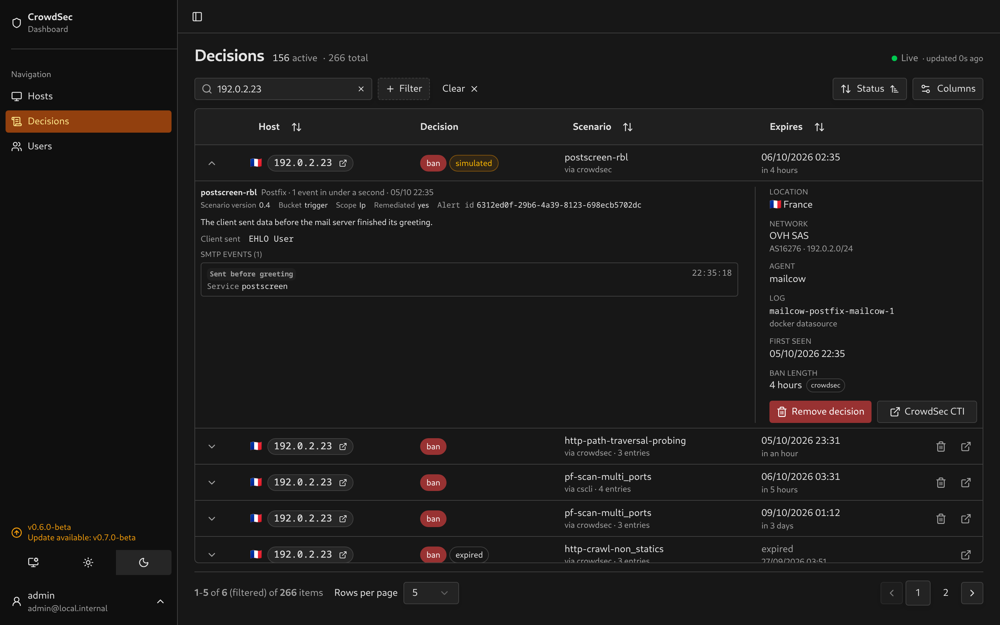
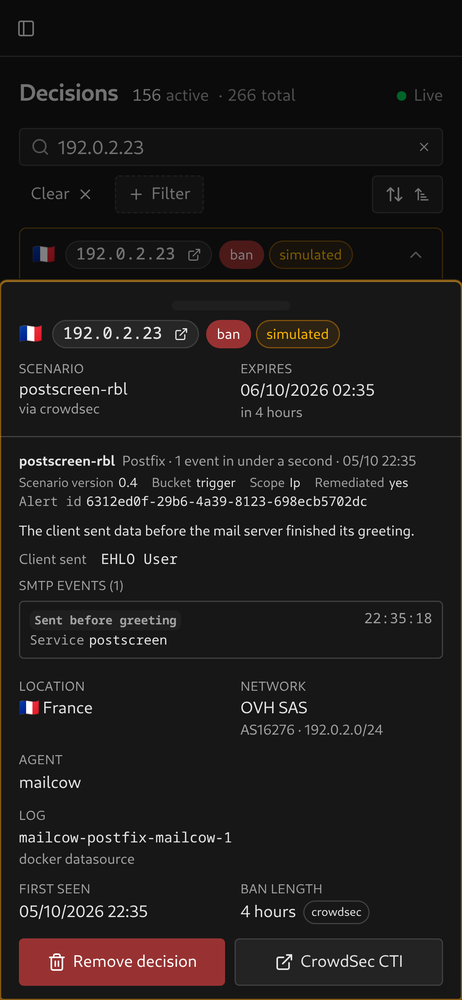

# Postfix

Recognises smtpd events with `log_type: postfix` and postscreen events with `service: postscreen`, including mailcow's Docker logs. Tested against captured `crowdsecurity/postscreen-rbl`, `crowdsecurity/postfix-spam` and `crowdsecurity/postfix-non-smtp-command` alerts.

## Evidence

A postscreen alert opens with an explanation of the recorded violation and what the client sent. `PREGREET` appears as **Sent before greeting**: the client sent data before the server finished its SMTP greeting. The scenario name `postscreen-rbl` does not establish a blocklist match; the retained events record early client input.

An smtpd alert shows the disconnect stage and non-SMTP input when relevant. **CONNECT** means the connection ended before an SMTP command was recorded; **UNKNOWN** means it ended after a command Postfix did not recognise. The `spam-attempt` category includes lost connections and authentication failures, so the UI describes the recorded behavior without assuming a message was sent.

HTTP requests are labeled **HTTP request sent to the mail server**. Bytes with a TLS handshake prefix show **Looks like a TLS handshake**. The prefix suggests TLS but not which version was negotiated. The logged bytes stay visible. A newline-only greeting shows **Line break without an SMTP command**.

Client payloads and disconnect stages summarise the whole alert and cannot be paired with individual events. Missing values show **Not recorded**. One line per retained event shows its violation, action or category, with the service, reason, client hostname and timestamp when available. The list counts SMTP events rather than assuming each log record is a separate connection.

<table>
  <tr>
    <td></td>
    <td></td>
  </tr>
</table>

The container appears in the facts column.

The captured postscreen alert carries `PREGREET`, `service: postscreen` and a container ID, alongside shared timestamp, source and location metadata. It has no RBL name or rejection reason. The scenario name alone does not establish which blocklist, if any, matched.

Captured smtpd events carry `spam-attempt` or `non-smtp-command` categories and a client hostname. Action and reason are supported when supplied, but are absent from these captures. There are no target chips or entry counts for mail connections. Postfix does not log the username of a failed SASL login; on mailcow, [Dovecot](dovecot.md) handles authentication and reports the mailboxes tried.

## Alert-context configuration

CrowdSec's Postfix and postscreen parsers read what the client sent from each log line, but do not include it in the alert. Without alert context the dashboard shows **Not recorded** for these values.

Add a context file on the CrowdSec agent that reads the Postfix logs, for example `/etc/crowdsec/contexts/postfix.yaml`:

```yaml
context:
  client_sent:
    - evt.Parsed.message_attempt # postscreen: sent before the greeting
  lost_after:
    - evt.Parsed.smtp_response # smtpd: the stage it hung up at, e.g. AUTH
  smtp_command:
    - evt.Parsed.command # smtpd: a non-SMTP line, e.g. GET / HTTP/1.1
```

Restart CrowdSec to load it. Only alerts raised after the change carry these values. See [CrowdSec's alert context](https://docs.crowdsec.net/docs/log_processor/alert_context/intro) for the file format.

## Setup

Configure CrowdSec to collect Postfix logs and give the dashboard [watcher credentials](../lapi-setup.md). Existing stored alerts are parsed again when expanded. Mailcow authentication events are covered by [Dovecot](dovecot.md).

The screenshots use sanitized captured metadata with demo addresses and shifted timestamps.
